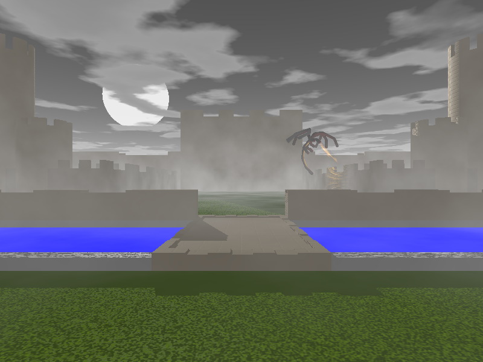

[](https://opensource.org/licenses/MIT)

# POV-Ray Dracula Castle

A castle rendered using the [Persistence of Vision Raytracer](http://www.swi-prolog.org/).

This program was created for CS355: Principles of Programming Languages at Old Dominion University during Spring 2018.

## Usage

You will need [POV-Ray](http://www.swi-prolog.org/):

```bash
sudo apt install povray
```

To start run the following from the src directory:

```bash
povray render_castle.pov
```

### Output



## Versioning

We use [SemVer](http://semver.org/) for versioning. For the versions available, see the [tags on this repository]().

## Authors

* **Patrick Cox** - *Contributor* - [paddy74](https://github.com/paddy74)

## License

This project is licensed under the MIT License - see the [LICENSE.md](LICENSE.md) file for details.

## Acknowledgments

* Our professor [Jay Morris](http://www.cs.odu.edu/~jdm/)
